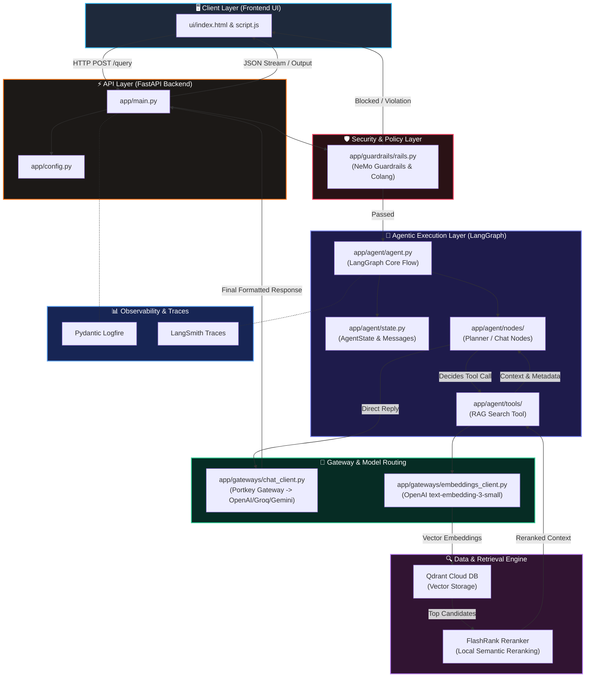

#  System Overview & Architecture

Welcome to the **System Overview** for **PyDocs AI** (Enterprise Agentic RAG). This document provides an end-to-end breakdown of how the architecture is designed, how data flows through various modules, and the exact roles played by each component in the codebase.

---

##  Executive Summary

**PyDocs AI** is designed to overcome the key limitations of naive RAG implementations (such as hallucinations, lack of guardrails, poor context relevancy, and unmonitored execution). It combines:
1. **LangGraph State Management** for multi-step reasoning and dynamic tool execution.
2. **NeMo Guardrails** for strict enterprise input/output policy enforcement.
3. **Portkey LLM Gateway** for reliable multi-provider model routing and automatic fallbacks.
4. **Qdrant Cloud + FlashRank** for hybrid vector retrieval and zero-latency local re-ranking.
5. **Logfire & LangSmith** for 100% transparent end-to-end tracing and observability.

---

##  End-to-End System Architecture Diagram


The flowchart below shows the complete lifecycle of a user query—from the frontend UI, through guardrails, into the agent graph, down to data retrieval and response generation:




## Project Directory Structure

```text
enterprise-agentic-rag /
├── app/
│   ├── agent/
│   │   ├── nodes/
│   │   ├── tools/
│   │   ├── agent.py
│   │   └── state.py
│   ├── gateways/
│   │   ├── chat_client.py
│   │   └── embeddings_client.py
│   ├── guardrails/
│   │   ├── colang_rules.py
│   │   └── rails.py
│   ├── ingestion/
│   │   ├── chunking/
│   │   │   └── splitter.py
│   │   ├── loaders/
│   │   │   └── documents_loader.py
│   │   └── processor.py
│   ├── services/
│   │   └── retrieval/
│   ├── config.py
│   └── main.py
├── DATA/
│   ├── noisy_data/
│   └── true_data/
│       ├── advanced_docs/
│       ├── core_docs/
│       └── model_docs/
├── DOCS/
│   ├── 01_SYSTEM_OVERVIEW.md
│   ├── 02_INGESTION_ENGINE.md
│   ├── 03_AGENT.md
│   ├── 04_OBSERVABILITY.md
│   ├── 05_ENVIRONMENT_VARIABLES.md
│   ├── 06_GUARDRAILS.md
│   ├── 07_LLM_GATEWAY.md
│   └── 08_EVALS_PIPELINE.md
├── evals/
│   ├── eval_pipeline.py
│   ├── rag_evaluation_executive_report.pdf
│   └── rag_evaluation_questions.json
├── observability/
├── ui/
│   ├── Screenshots/
│   ├── index.html
│   ├── logo.png
│   ├── script.js
│   └── styles.css
├── xyz/
├── .env
└── requirements.txt
```

## Deep Dive into Core Modules

### 1. Client & API Layer (ui/ & app/main.py)
- UI Interface (ui/index.html, script.js): Web user interface for streaming user queries and displaying real-time agent responses.
- FastAPI Server (app/main.py): Serves as the main REST endpoint (/query). It receives incoming payload requests, validates schema formatting, and passes control to the safety guardrail layer.

### 2. Security & Policy Layer (app/guardrails/)
- NeMo Guardrails (rails.py & colang_rules.py): Acts as the frontline defense. Before any LLM call is executed, guardrails evaluate the input for prompt injections, jailbreaks, and off-topic questions.


### 3. Agentic Execution Layer (app/agent/)
- LangGraph State Manager (agent.py & state.py): Manages multi-turn conversation memory and tracks dynamic states across turns.

- Nodes & Tools (nodes/, tools/): Contains planning and chat logic. If external factual knowledge is needed, the node routes execution to the RAG search tool (rag_search_tool).


### 3. Agentic Execution Layer (app/agent/)
- LangGraph State Manager (agent.py & state.py): Manages multi-turn conversation memory and tracks dynamic states across turns.
- Nodes & Tools (nodes/, tools/): Contains planning and chat logic. If external factual knowledge is needed, the node routes execution to the RAG search tool (rag_search_tool).


### 5. Retrieval & Reranking Engine (app/services/retrieval/ & app/ingestion/)
- Document Ingestion (processor.py, splitter.py, documents_loader.py): Loads raw markdown documentation from DATA/true_data/, chunks it logically, generates embeddings, and indexes them into Qdrant Cloud.

- Vector DB & Reranker (Qdrant & FlashRank): Fetches the top vector candidate matches from Qdrant Cloud and passes them to FlashRank for local, low-latency cross-encoder reranking.


### 6. Observability & Tracing (observability/, Logfire & LangSmith)
- Logfire: Monitors code-level execution steps, performance bottlenecks, and API request latency.

- LangSmith: Records step-by-step LLM traces, prompt inputs, tool usage outputs, and evaluation metrics.


## Data Flow Lifecycle
- User Request: User submits a prompt through the Web UI.

- API & Guardrails: FastAPI receives the request and passes it to NeMo Guardrails.

- If flagged, a safety response is immediately returned.

- If clear, execution continues to the Agent.

- Agent Planning: LangGraph evaluates state and determines whether to answer directly or query docs.

- Vector Retrieval & Reranking:

- Search queries are embedded via Portkey.

- Nearest candidates are retrieved from Qdrant Cloud DB.

- Candidates are reranked locally using FlashRank.

- Response Generation: The agent processes the reranked context, formats the final answer, and streams it back to the client.
