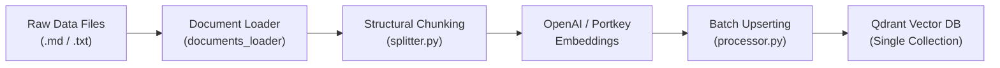

# ⚙️ Data Ingestion Engine & Pipeline Architecture

This document provides a comprehensive architectural overview, modular breakdown, step-by-step workflow, and technical implementation details for the **Data Ingestion Engine**.

---

## 1. Pipeline Overview

The primary goal of the Data Ingestion Pipeline is to efficiently process, chunk, embed raw markdown and text documents, and store them in the **Qdrant Vector Database**. This ensures high-precision search and retrieval for downstream Retrieval-Augmented Generation (RAG) applications.




---

## 2. Directory & File Structure

```text
ingestion/
├── __init__.py
├── processor.py             # Main pipeline orchestrator and entry point
├── chunking/
│   ├── __init__.py
│   └── splitter.py          # Structural chunking and sentence-splitting logic
└── loaders/
    ├── __init__.py
    └── documents_loader.py  # Recursive file loading and metadata parsing

services/retrieval/
├── embeddings.py            # Embedding generation with Portkey gateway & retry logic

```
---

## 3. Pipeline Core Modules & Logic

### Document Loader (ingestion/loaders/documents_loader.py)
- Recursive File Scanning: Uses Path.rglob() to scan target directories for specified file extensions (e.g., .md, .txt).

- Validation & Error Handling: Automatically skips empty or unreadable files without crashing the pipeline execution.

- Metadata Tagging: Extracts raw content alongside metadata attributes (source path and file_name).

```text
# Usage Example:
raw_docs = load_documents("Data/core_docs", extension=".md")
```


### Structural Chunking Engine (ingestion/chunking/splitter.py)
- The chunking strategy preserves logical structure, paragraph context, and sentence boundaries.

- Paragraph Aggregation: Merges smaller paragraphs sequentially until reaching the target chunk size limit (default: 800 characters).

- Sentence-Aware Splitting: Oversized paragraphs are gracefully split across standard sentence boundaries (., !, ?).

- Logfire Telemetry: Captures real-time metrics including total generated chunks and average chunk size.

```text
# Usage Example:
chunks = chunk_text(doc_content, chunk_size=800)

```

### Embedding Generation (services/retrieval/embeddings.py)
- Portkey Gateway Integration: Routes embedding generation through Portkey gateway for load balancing and fallback management.

- Batch Processing: Groups text chunks into configurable batches (BATCH_SIZE = 50) to comply with API rate limits.

- Exponential Backoff Retries: Handles transient network issues and rate limits via an automated 3-tier retry algorithm.

```text
# Batch Embed Call:
vectors = embed_batch(["chunk text 1", "chunk text 2"])
```

### Ingestion Processor & Vector Upsert (ingestion/processor.py)
- Unified Collection Architecture: Stores all categories within a single Qdrant collection using payload fields for categorization.

- Category Cleanup Mechanism: Prevents stale or orphaned vectors by clearing existing category data prior to re-ingestion:

```text
delete_category_points(collection_name, category)
Deterministic UUID Generation: Generates deterministic Point IDs (uuid5) based on file source path and chunk index to guarantee uniqueness and prevent collision issues.
```

### Executing Ingestion
- To execute the complete ingestion pipeline, run the main processor script:

```bash
python -m app.ingestion.processor
```