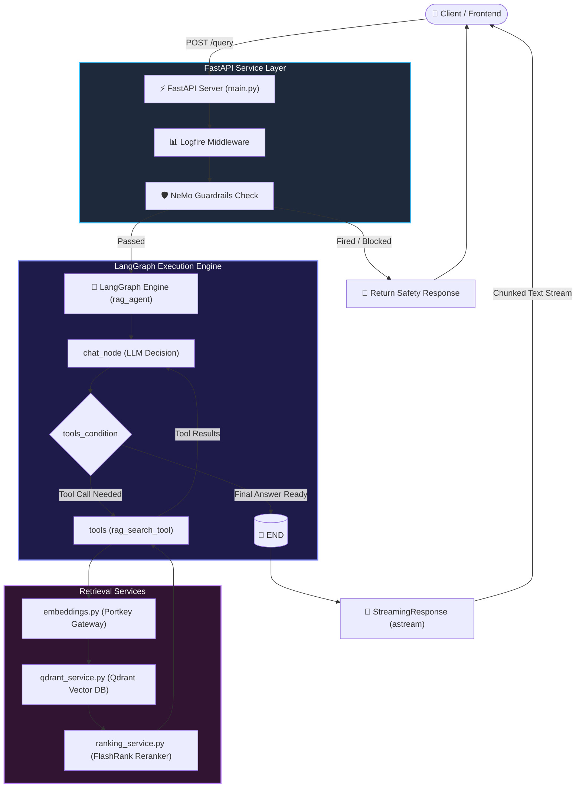

#  LangGraph RAG Agent & FastAPI Architecture 

This document defines the complete architectural design, execution flow, component interaction, and FastAPI integration for the **Pydocs AI RAG Agent**.

---

##  1. Executive Summary

The agent is built as an intelligent, stateful execution graph using **LangGraph** and served over **FastAPI**. It processes incoming queries through safety **Guardrails** (NeMo Guardrails), manages thread-based short-term memory (`InMemorySaver`), dynamically decides when to invoke external tools (Vector Retrieval via Qdrant & FlashRank Reranking), and streams responses in real-time.

---

##  2. System Architecture & End-to-End Pipeline Flow

When a user submits a query via the API, it passes through sequential processing layers from entry to streaming completion.

---

##  3. Directory & File Structure

```text
app/
├── main.py                     # FastAPI application entrypoint & routing logic
├── config.py                   # Environment configuration & project settings
├── agent/
│   ├── agent.py                # LangGraph StateGraph builder, checkpointer & compilation
│   ├── state.py                # Typed Dict defining AgentState and message history
│   ├── nodes/
│   │   ├── chat_node.py        # Core LLM invocation node
│   │   └── prompt.py          # System prompt definitions and templates
│   └── tools/
│       └── rag_tool.py         # Vector search tool (Qdrant + Reranker integration)
├── gateways/
│   ├── chat_client.py          # LLM client initialized via Portkey AI Gateway
│   └── embeddings_client.py    # Embeddings client initialized via Portkey AI Gateway
├── guardrails/
│   ├── colang_rules.py         # Colang rules for domain-specific guarding
│   └── rails.py                # Guardrails initializer and evaluation engine
└── services/
    └── retrieval/
        ├── embeddings.py       # Query vector embedding generator
        ├── qdrant_service.py   # Vector similarity search engine
        └── ranking_service.py  # Cross-Encoder / FlashRank reranking engine
```

---

##  4. Detailed Execution Pipeline

### Step 1: Request Ingestion & Logfire Monitoring
1. A `POST` request is sent to `/query` containing `q` (query string) and `thread_id` (session identifier).
2. `logfire.instrument_fastapi(app)` automatically captures HTTP headers, timing, latency, and status codes.
<br><br>
### Step 2: Guardrails Evaluation (`guardrails/rails.py`)
1. Before calling the agent graph, the input is evaluated by **NeMo Guardrails**.
2. If safety policies or off-topic rules are violated (`fired == True`), execution is short-circuited and a pre-defined guardrail response is returned directly to the client as a `StreamingResponse`.
<br><br>
### Step 3: LangGraph Execution Engine (`agent/agent.py`)
If guardrails pass, the query is pushed to the `rag_agent` compiled graph:
1. **Thread Memory**: Configured with `InMemorySaver` using `thread_id` to persist conversation history across requests.
2. **`chat_node`**: Receives user input and system prompts, then evaluates whether direct text or tool execution is needed.
3. **`tools_condition`**:
   - If the LLM produces a tool call (e.g., `rag_search_tool`), routing dynamically moves to the **`tools`** node.
   - If no tool is needed, execution transitions to `END`.
<br><br>
### Step 4: RAG Retrieval Tool Flow (`agent/tools/rag_tool.py`)
When `rag_search_tool` is executed:
1. **Query Embedding** (`embeddings.py`): Converts text into a 1536-dimensional vector using OpenAI via Portkey Gateway.
2. **Qdrant Vector Search** (`qdrant_service.py`): Filters documents by official categories (`core_docs`, `advanced_docs`, `model_docs`) and retrieves top vector matches.
3. **FlashRank Reranking** (`ranking_service.py`): Re-scores and re-ranks retrieved passages to maximize context precision and eliminate noise.
4. Tool outputs are looped back to `chat_node` for final response synthesis.
<br><br>
### Step 5: Streaming Response (`main.py`)
- The FastAPI endpoint uses `rag_agent.astream(..., stream_mode="messages")`.
- `AIMessageChunk` tokens are yields as `StreamingResponse(media_type="text/plain")` for real-time streaming to the user.

---
<br><br>
##  5. API Endpoints

| Endpoint | Method | Description |
| :--- | :--- | :--- |
| `/health` | `GET` | Health check endpoint returning system status. |
| `/` | `GET` | Home endpoint confirming service active status. |
| `/graph` | `GET` | Renders and returns the visual LangGraph structure as a PNG image (`draw_mermaid_png()`). |
| `/query` | `POST` | Primary entry point accepting user prompt and returning chunked streaming responses. |

---

##  6. How to Run the Server

Start the FastAPI application with Uvicorn:

```bash
uvicorn app.main:app --reload --host 0.0.0.0 --port 8000
```
