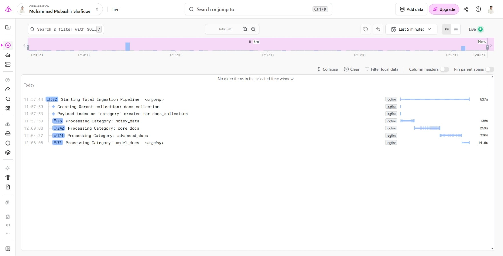
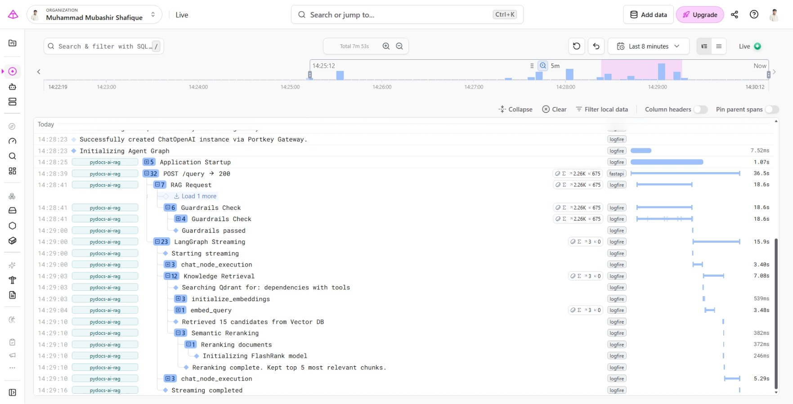

#  System Observability & Telemetry 

This document details the observability, tracing, and monitoring architecture implemented across the entire application using **Pydantic Logfire**.

---

##  1. What is Logfire & Why Was It Used?

**Pydantic Logfire** is an OpenTelemetry-centric observability platform designed specifically for modern Python applications. It provides deep visibility into complex asynchronous and multi-stage systems such as RAG pipelines and LLM agents.

In this project, Logfire serves as the primary telemetry platform to:
- **Trace Structural Pipelines**: Measure document loading, chunking, and embedding execution times step-by-step.
- **Monitor LLM Agent Execution**: Track state transitions, tool invocation triggers, guardrail checks, and token streaming performance.
- **Instrument Infrastructure**: Monitor FastAPI endpoints, HTTP request lifecycles, and database operations seamlessly.
- **Provide Visual Telemetry**: Offer interactive span trees to identify bottlenecks, latency spikes, and exceptions instantly.

---

##  2. Pipeline Tracing & Telemetry Architecture

Logfire spans are instrumented at every critical phase of the application stack:

```text
[FastAPI Middleware / Request]
        │
        ├── [Guardrails Check]
        │
        └── [LangGraph Engine: rag_agent]
                │
                ├── [chat_node_execution]
                │
                └── [Knowledge Retrieval Tool]
                        ├── [embed_query]
                        ├── [Qdrant Vector Search]
                        └── [Semantic Reranking (FlashRank)]
```

---

##  3. Real-Time Telemetry Dashboard & Traces

### 3.1 Data Ingestion Pipeline Dashboard
The ingestion engine uses hierarchical Logfire spans to track the processing of raw document collections. Each category (`noisy_data`, `core_docs`, `advanced_docs`, `model_docs`) runs inside isolated telemetry spans to measure parsing time, payload creation, and batch upload performance.



#### Key Ingestion Insights:
- **Collection Setup**: Tracks Qdrant collection creation (`docs_collection`) and payload indexing on `category`.
- **Category Spans**: Visualizes individual category processing times (e.g., `core_docs` took ~259s, `advanced_docs` took ~220s).
- **Execution Telemetry**: Monitors full pipeline execution times across hundreds of chunks.

---

### 3.2 End-to-End RAG Execution Trace
When a request hits the `/query` endpoint, Logfire records the complete execution lifecycle in a nested trace tree, providing real-time visibility from guardrail validation to final token streaming.



#### Detailed Trace Decomposition:
1. **Application Startup & Setup**: Tracks initialization of ChatOpenAI instances via Portkey Gateway and LangGraph agent compilation.
2. **FastAPI Request Handling**: Captures incoming `POST /query -> 200` requests with latency tracking (e.g., 36.5s total request time).
3. **Guardrails Check**: Logs NeMo Guardrails validation (`Guardrails passed` in ~18.6s).
4. **LangGraph Streaming Execution**:
   - `chat_node_execution`: Initial decision to trigger retrieval tool (3.40s).
   - `Knowledge Retrieval`:
     - `embed_query`: Converts text query to vector representation (3.48s).
     - **Vector Search**: Candidate retrieval from Qdrant vector database (15 candidates retrieved).
     - **Semantic Reranking**: FlashRank model initialization and cross-encoder re-scoring (top 5 relevant chunks selected in 382ms).
   - `chat_node_execution`: Final answer generation and chunked streaming back to the client (5.29s).

---

##  4. Enabling Logfire in the Project

Follow these steps to integrate and enable Logfire in your local setup or project:

### Step 1: Install the Logfire Package
Install the Logfire package via your terminal/command line:
```bash
pip install logfire

```
If you are using FastAPI and Pydantic tracking, install it with full integration extras:

```bash
pip install "logfire[fastapi,pydantic]"

```
<br><br>
### Step 2: Authenticate via Terminal CLI
Authenticate your account using the Logfire CLI:
```bash
logfire auth

```

> Note: This command will open a browser link. Log in to your Logfire account, copy the authorization code/token, and paste it back into the terminal to verify.

<br><br>
### Step 3: Set Environment Variables (.env)
If you are running in automated environments or production CI/CD pipelines, add your token to the .env file:

```bash
LOGFIRE_TOKEN=your_logfire_read_write_token
```
