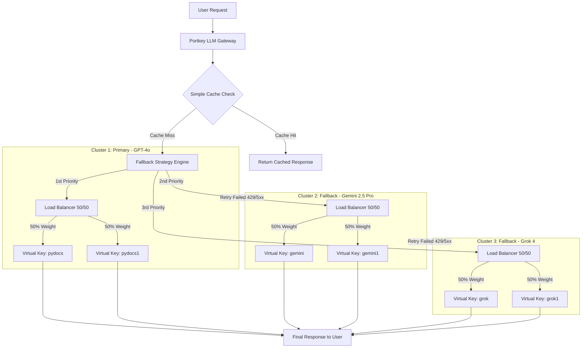

# LLM Gateway Architecture


## 1. What is an LLM Gateway?
An LLM Gateway is a centralized management proxy layer that acts as an intermediary between client applications and multiple Large Language Model (LLM) providers (like OpenAI, Google Gemini, xAI Grok, etc.). Instead of connecting directly to provider APIs, all application requests route through the gateway.


## 2. Why Use an LLM Gateway in This Project?
Using an LLM Gateway provides essential enterprise-grade capabilities:

- High Availability & Reliability: Automatically handles retries, load balancing, and fallbacks if a provider goes down or rate limits occur.

- Unified API Interface: Provides a standardized endpoint regardless of the underlying LLM provider.

- Cost & Performance Optimization: Reduces latency and cost via caching mechanisms.

- Security & Key Management: Uses virtual keys so primary API keys are never exposed directly in application code.


In this project, we are using Portkey as our primary LLM Gateway platform.


## 4. Key Features Implemented in This Configuration
- Multi-Cluster Fallback Strategy: Primary requests go to Cluster 1 (GPT-4o). If it fails after retries, it automatically falls back to Cluster 2 (Gemini 2.5 Pro), and finally to Cluster 3 (Grok 4).

- 50/50 Load Balancing: Within each cluster, traffic is split evenly (50/50) between two virtual keys to distribute request loads smoothly.

- Automatic Retries: Requests automatically retry up to 3 times on specific failure status codes (429, 500, 502, 503, 504).

- Semantic / Simple Caching: Enabled (mode: "simple") to instantly serve repeated queries without hitting provider APIs.

- Request Timeouts: Configured timeouts (30s for chat, 15s for embeddings) to prevent hanging requests.


## 5. Architectural Flow Diagram



## Gateway Configurations

### A. Embeddings Gateway Config (PORTKEY_EMBED_CONFIG_ID)

```
{
  "strategy": {
    "mode": "loadbalance"
  },
  "targets": [
    {
      "virtual_key": "pydocs",
      "weight": 0.5,
      "override_params": {
        "model": "text-embedding-3-small"
      }
    },
    {
      "virtual_key": "pydocs1",
      "weight": 0.5,
      "override_params": {
        "model": "text-embedding-3-small"
      }
    }
  ],
  "retry": {
    "attempts": 3,
    "on_status_codes": [429, 500, 502, 503, 504]
  },
  "cache": {
    "mode": "simple"
  },
  "request_timeout": 15000
}
```

### B. Chat Models Gateway Config (PORTKEY_CHAT_CONFIG_ID)
```
{
  "strategy": {
    "mode": "fallback"
  },
  "targets": [
    {
      "strategy": {
        "mode": "loadbalance"
      },
      "targets": [
        {
          "virtual_key": "pydocs",
          "weight": 0.5,
          "override_params": {
            "model": "gpt-4o"
          }
        },
        {
          "virtual_key": "pydocs1",
          "weight": 0.5,
          "override_params": {
            "model": "gpt-4o"
          }
        }
      ],
      "retry": {
        "attempts": 3,
        "on_status_codes": [429, 500, 502, 503, 504]
      }
    },
    {
      "strategy": {
        "mode": "loadbalance"
      },
      "targets": [
        {
          "virtual_key": "gemini",
          "weight": 0.5,
          "override_params": {
            "model": "gemini-2.5-pro"
          }
        },
        {
          "virtual_key": "gemini1",
          "weight": 0.5,
          "override_params": {
            "model": "gemini-2.5-pro"
          }
        }
      ],
      "retry": {
        "attempts": 3,
        "on_status_codes": [429, 500, 502, 503, 504]
      }
    },
    {
      "strategy": {
        "mode": "loadbalance"
      },
      "targets": [
        {
          "virtual_key": "grok",
          "weight": 0.5,
          "override_params": {
            "model": "grok-4"
          }
        },
        {
          "virtual_key": "grok1",
          "weight": 0.5,
          "override_params": {
            "model": "grok-4"
          }
        }
      ],
      "retry": {
        "attempts": 3,
        "on_status_codes": [429, 500, 502, 503, 504]
      }
    }
  ],
  "cache": {
    "mode": "simple"
  },
  "request_timeout": 30000
}
```