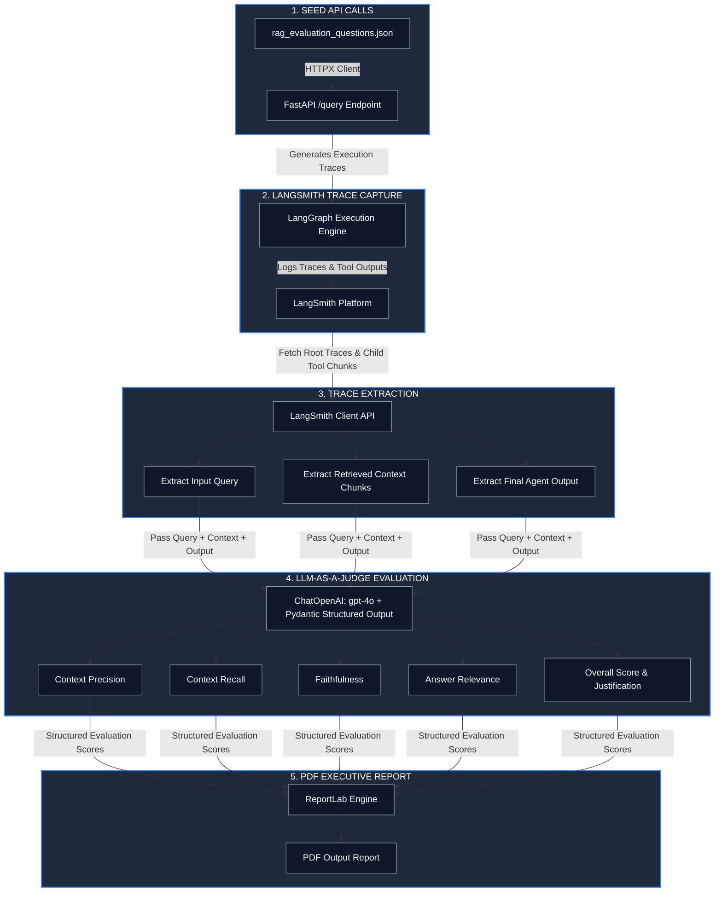

##  Executive Overview

This evaluation pipeline is an end-to-end framework designed to measure, benchmark, and audit the performance of a Production Retrieval-Augmented Generation (RAG) System built on top of **FastAPI**, **LangGraph**, and **LangSmith**. 

The pipeline automates the entire evaluation lifecycle:
1. **API Seeding / Data Ingestion:** Triggers real system requests to capture operational traces.
2. **Trace Extraction:** Pulls top-level execution flows and child tool logs from LangSmith.
3. **LLM-as-a-Judge Evaluation:** Uses `gpt-4o` with structured Pydantic outputs to grade performance across 4 core RAG metrics.
4. **Executive Report Generation:** Compiles findings into a PDF executive dashboard.

---

##  Pipeline Architecture & Step-by-Step Flow

Below is the complete architectural flow showing how data flows from dataset ingestion to trace scoring and report generation:

---

##  Detailed Step-by-Step Execution Breakdown

### Step 1: Seeding API with Evaluation Questions (`hit_api_with_questions`)
- Reads test queries from `rag_evaluation_questions.json`.
- Sends POST requests to `http://127.0.0.1:8000/query` using an asynchronous/streamed `httpx.Client`.
- Generates live production-like execution traces inside the active LangGraph execution graph.
- Implements a waiting period (e.g., 10 seconds) post-seeding to ensure all asynchronous background traces fully sync with LangSmith.

### Step 2: Fetching LangGraph Root Traces (`fetch_latest_traces`)
- Connects to LangSmith via `Client()` and queries the project run store for top-level root executions (`execution_order=1`).
- Filters execution nodes specifically for `name == "LangGraph"`.
- Recursively inspects child tool runs (`run_type in ["retriever", "tool"]`) to capture the exact context chunks retrieved by vector search nodes.

### Step 3: LLM-as-a-Judge Evaluation (`evaluate_trace`)
- Builds an evaluation prompt combining the **User Query**, **Retrieved Context Chunks**, and **Generated Agent Output**.
- Uses `ChatOpenAI(model="gpt-4o", temperature=0)` configured with `with_structured_output(AdvancedRAGEvaluation)`.
- Returns strictly typed metrics:
  - **Context Precision:** Signal-to-noise ratio in retrieved context.
  - **Context Recall:** Coverage of necessary information retrieved.
  - **Faithfulness:** Groundedness of the answer against retrieved context (hallucination check).
  - **Answer Relevance:** Direct alignment between user query and generated answer.
  - **Overall Score:** Weighted aggregated health score.

### Step 4: Executive PDF Generation (`generate_executive_pdf`)
- Compiles evaluated trace data into a high-level executive PDF dashboard using `ReportLab`.
- Includes high-level KPI cards (Overall Health, Precision, Recall, Faithfulness, Relevance).
- Renders detailed trace performance breakdown tables with visual color-coded score indicator bars.

---

##  Evaluation Matrix & Benchmark Results

The table below demonstrates the evaluation breakdown across test traces processed through the `gpt-4o` evaluation judge:

| Trace ID | User Question | Precision | Recall | Faithfulness | Relevance | Overall Score | Visual Bar | Justification / Key Findings |
| :--- | :--- | :---: | :---: | :---: | :---: | :---: | :---: | :--- |
| **#019fd290** | What are the five levels of complexity for building multi-agent applications in Pydantic AI? | 0.90 | 0.90 | 0.95 | 1.00 | **0.94** | 🟢 `[█████████░]` | Highly faithful and relevant. Minor extraneous context slightly impacted precision. |
| **#019fd28f** | What database is used in the RAG example, and how is it run locally? | 0.90 | 0.80 | 0.95 | 0.90 | **0.89** | 🟢 `[████████░░]` | Accurately cited PostgreSQL + pgvector Docker command. Minor recall gap regarding SDK role. |
| **#019fd28e** | How does Pydantic AI's dependency injection system provide data to system prompts, tools, and output validators? | 0.90 | 0.85 | 0.95 | 0.90 | **0.90** | 🟢 `[█████████░]` | Strong alignment. Clear explanation of `RunContext` and `deps_type`. |
| **#019fd28d** | What are the two decorators used to register function tools with an agent, and how do they differ? | 0.80 | 0.70 | 0.90 | 0.90 | **0.85** | 🟢 `[████████.░]` | Captured `@agent.tool` well; missed explicit mention of `@agent.tool_plain` in retrieved chunk. |

---

> **Note:** You can easily scale this pipeline to evaluate across a larger set of questions by increasing the `LIMIT_QUESTIONS` parameter or targeting additional test categories.