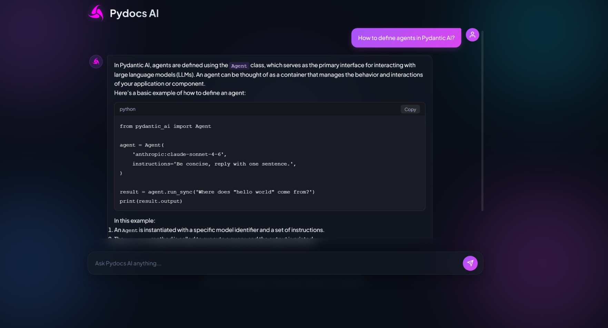
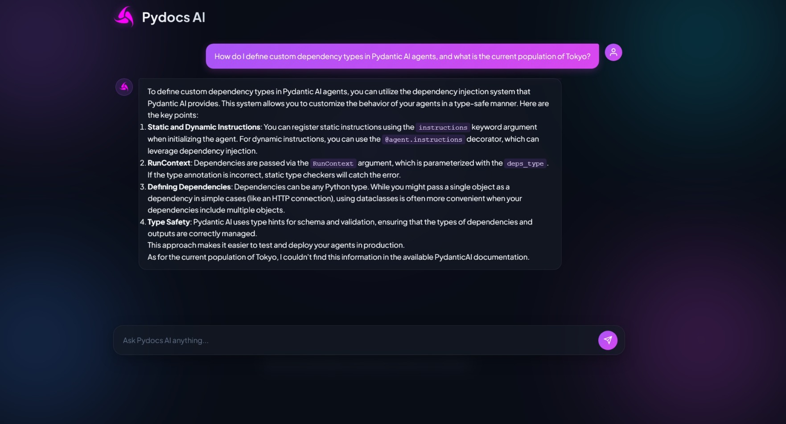
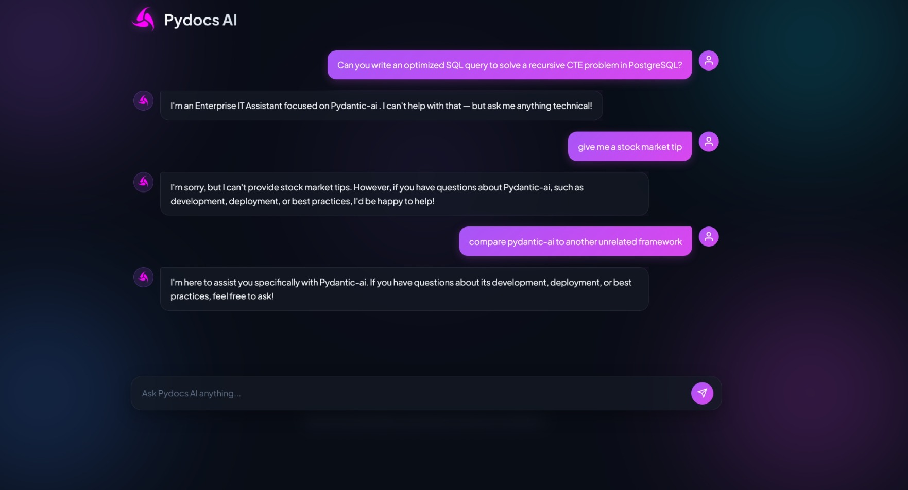

#  PyDocs AI — UI Screenshots & Previews

Welcome to the UI preview hub for **PyDocs AI**. Explore the interface screens, features, and system guardrails below.

---

 

### 1. Landing Page & Quick-Start Hub

*A clean dark-mode dashboard featuring quick-start topic cards and search triggers to begin exploring PydanticAI documentation.*

 
 

---

 

### 2. Code Generation & Structured Technical Explanation

*Renders clean, syntax-highlighted Python code blocks with quick-copy actions and detailed step-by-step technical explanations.*

 
 

---

 

### 3. Out-of-Domain Detection & Knowledge Grounding

*Handles hybrid queries by providing accurate technical answers while gracefully identifying and refusing out-of-scope knowledge requests.*

 
 

---

 

### 4. NeMo Guardrails & Safety Enforcement

*Enforces real-time safety guardrails to block prompt injections, off-topic requests, and non-relevant technical queries.*

 
 

---

 

[⬅️ Back to Main Repository README](../README.md)
