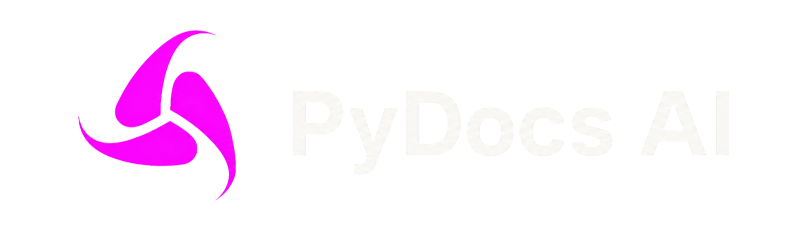
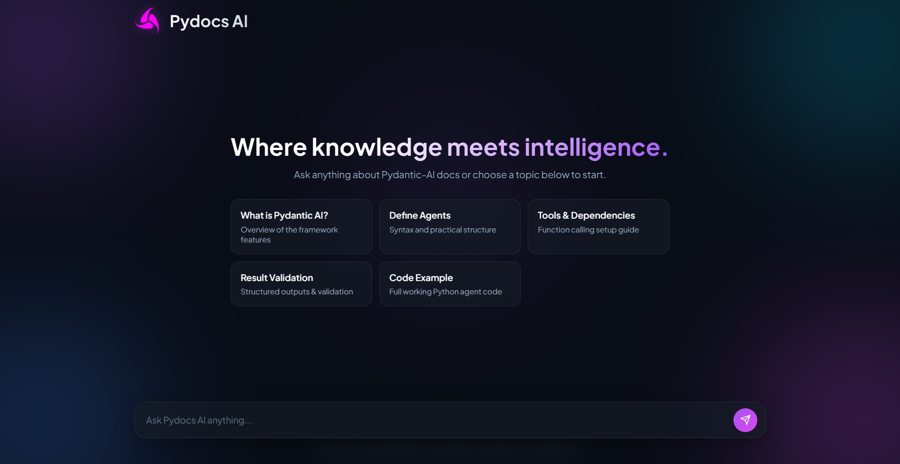
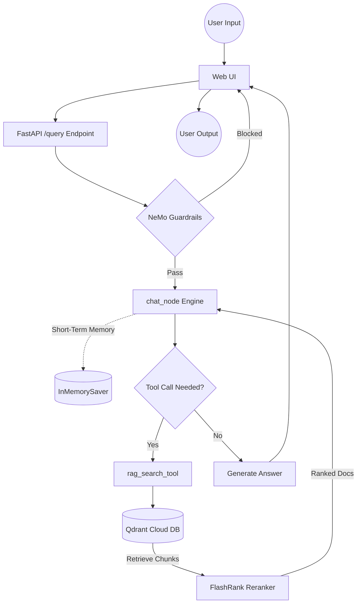

<!-- <p align="left">
  
</p>

<h1 align="center">PyDocs AI</h1> -->
<p align="center">

<picture>
  <source media="(prefers-color-scheme: dark)" srcset="./xyz/banner-dark.png">
  <source media="(prefers-color-scheme: light)" srcset="./xyz/banner-light.png">
  
</picture>

</p>

<p align="center">
  
  
  
  
  
</p>

---

**Repo:** `enterprise-agentic-rag`

# PyDocs AI (Enterprise Agentic RAG)


## Project Overview
**PyDocs AI** is an enterprise-ready, agentic RAG system built to provide accurate and secure document intelligence. Using **LangGraph** for multi-step reasoning and state management, the agent intelligently handles user queries while ensuring enterprise-grade safety with **NeMo Guardrails**. It leverages **Qdrant** for vector search, **FlashRank** for fast local re-ranking, and **Portkey** as an LLM gateway for reliable routing and fallback. The system is specifically built over the official **PydanticAI documentation** and is fully monitored using **Logfire** and **LangSmith** for complete end-to-end observability.

---
## Application Preview



*Figure 1: PyDocs AI Interface with dynamic topic selection and quick-start prompts.*

<p align="center">
  <a href="./DOCS/UI.md">
    <font color="red"><b>🔴 For more preview and response screenshots, click here!</b></font>
  </a>
</p>

---
## Key Features

* **Autonomous Agent Workflows:** Uses **LangGraph** to build cyclic agent graphs, multi-step planning, and dynamic conversation memory.
* **Enterprise Guardrails & Safety:** Powered by **NeMo Guardrails** to automatically block off-topic queries, prompt injections, and jailbreak attempts.
* **Smart Gateway & Fallbacks:** Integrates **Portkey AI** to manage LLM API requests with smart routing, retries, and backup provider fallbacks.
* **High-Performance Vector Search & Reranking:** Fast semantic search via **Qdrant Cloud Vector DB** combined with **FlashRank** for zero-latency local re-ranking.
* **Strict Schema & Type Safety:** Uses **Pydantic (v2)** to enforce strict data structures, input validation, and structured outputs.
* **Full-Stack Observability:** Built-in deep tracing, latency tracking, and token usage monitoring using **Logfire** and **LangSmith**.
* **FastAPI Backend:** Fully async REST API built with **FastAPI** for high throughput and easy integration.
* **Automated PDF Report Generation:** Built-in **ReportLab** integration to generate downloadable PDF summaries and query reports.
* **Adversarial Red Teaming:** Includes an automated 8-module red-teaming test suite (direct prompt injections, XPIA, crescendo escalation) with an interactive Streamlit evaluation dashboard.

---

## System Architecture & Intelligence Flow



---

## Project Structure
```
📁 enterprise-agentic-rag/
├── 📁 app/            # Main application source code (Agent, Guardrails, Ingestion, Services)
│   ├── 📁 agent/      # Core AI Agent logic, state management, and tools
│   ├── 📁 gateways/   # LLM, Chat, and Embeddings API clients
│   ├── 📁 guardrails/ # Safety, validation, and Colang rules
│   ├── 📁 ingestion/  # Data loading and chunking pipeline
│   └── 📁 services/   # Core configuration and main service execution
├── 📁 DATA/           # Raw and testing datasets (noisy and true data)
├── 📁 DOCS/           # System documentation and architectural guides
├── 📁 evals/          # RAG pipeline evaluation scripts and test datasets
├── 📁 observability/  # System execution traces and Logfire tracking visual assets
├── 📁 red_teaming/    # PyRIT-based security testing suite & Streamlit attack dashboard
├── 📁 ui/             # Frontend user interface files and web screenshots
└── 📁 xyz/            # Visual branding assets (banners and graphics)

```
---


## Tech Stack

| Layer | Technology |
| :--- | :--- |
| **Orchestration** | LangChain + LangGraph |
| **LLMs** | OpenAI (`gpt-4o-mini`), Groq, Gemini |
| **Guardrails** | NeMo Guardrails |
| **Vector DB** | Qdrant Cloud |
| **Reranking** | FlashRank *(local, zero-latency)* |
| **Embeddings** | OpenAI (`text-embedding-3-small`) |
| **Observability** | Pydantic Logfire + LangSmith |
| **Evaluation** | LangSmith Traces + LLM-as-a-Judge |


---

##  Getting Started

Follow these steps to get **PyDocs AI** up and running on your local machine.

---

### 1.  Install Dependencies

Create a virtual environment and install the required Python packages:

```bash
# Create a virtual environment named 'tenvv'
python -m venv env

# Activate the virtual environment (Windows PowerShell)
.\env\Scripts\activate

# For Linux/macOS, use: source tenvv/bin/activate

# Install all required dependencies
pip install -r requirements.txt

```
### 2.  Configure Environment Variables

Create a .env file in the root directory of your project and add the following keys:

```bash


# Qdrant Vector Database

QDRANT_API_KEY=""
QDRANT_CLUSTER_ENDPOINT=""          # e.g., [https://your-cluster.cloud.qdrant.io:6333](https://your-cluster.cloud.qdrant.io:6333)


# Portkey LLM Gateway
PORTKEY_API_KEY=""
PORTKEY_EMBED_CONFIG_ID=""          # Config ID for embedding model routing
PORTKEY_CHAT_CONFIG_ID=""           # Config ID for chat model routing


# Model Configurations
CHAT_MODEL="gpt-4o-mini"
EMBEDDING_MODEL="text-embedding-3-small"
OPENAI_API_KEY=""


# LangSmith (Observability & Evaluation)
LANGSMITH_TRACING=true
LANGSMITH_API_KEY=""
LANGSMITH_PROJECT="pydocs-ai"
LANGSMITH_ENDPOINT="https://api.smith.langchain.com"

LOGFIRE_SEND_TO_LOGFIRE=false

```
> **NOTE:** For step-by-step guidance on getting API keys or resolving configuration issues, refer to our **[Environment Variables Guide](./DOCS/05_ENVIRONMENT_VARIABLES.md)** or check the full **[Documentation Hub](#-documentation-hub)**.

### 3. Run Data Ingestion
Parse your documents, process chunks, and index vectors directly into your Qdrant Vector Database:
```bash

# Run the complete data ingestion pipeline
python -m app.ingestion.processor

```

### 4. Launch the Application
```bash
# Start FastAPI backend server with hot-reload enabled
python -m uvicorn app.main:app --reload --port 8000

```

#### Frontend (Web Interface)
Open your HTML frontend file using the Live Server extension in VS Code.
Or simply double-click the HTML file to open it directly in your browser.

### 5. Run Evaluation Suite (Optional)
> **IMPORTANT NOTE**  
> Make sure the FastAPI backend server is running on `http://localhost:8000` **before** executing the evaluation pipeline.
```bash
# Execute the evaluation pipeline to benchmark performance
python -m evals.eval_pipeline
```

### 6. Run AI Red Team Dashboard (Optional)
```bash
# Launch interactive Streamlit red-teaming security dashboard
cd red_teaming
pip install -r requirements_for_red_teaming.txt
streamlit run app.py
```


---

## Documentation Hub

| # | Guide | What it covers |
| :---: | :--- | :--- |
| **01** | [System Overview](./DOCS/01_SYSTEM_OVERVIEW.md) | High-level vision and end-to-end flow |
| **02** | [Ingestion Engine](./DOCS/02_INGESTION_ENGINE.md) | Document parsing and indexing pipeline |
| **03** | [Agent](./DOCS/03_AGENT.md) | LangGraph graph, memory, and tool routing |
| **04** | [Observability](./DOCS/04_OBSERVABILITY.md) | Logfire + LangSmith tracing |
| **05** | [Environment Variables](./DOCS/05_ENVIRONMENT_VARIABLES.md) | All env vars and configuration reference |
| **06** | [Guardrails](./DOCS/06_GUARDRAILS.md) | NeMo Guardrails implementation |
| **07** | [LLM Gateway](./DOCS/07_LLM_GATEWAY.md) | Portkey routing, fallback, and observability |
| **08** | [Evals Pipeline](./DOCS/08_EVALS_PIPELINE.md) | Eval pipeline and result |
| **09** | [AI Red Teaming](red_teaming/README.md) | Security testing suite and attack modules |


---
