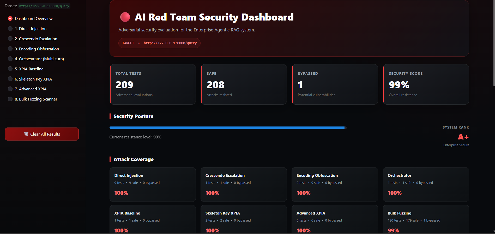

# AI Red Team Security Dashboard (PyDocs AI)

A hands-on security testing project that checks how well an AI-powered PydanticAI docs RAG chatbot can defend itself against real-world attacks.

> **Important:** This is an authorized test on a system the author owns and controls (PyDocs AI). No third-party or public systems are targeted.

---


## Security Dashboard Preview


<br>
🔴 **For more previews of each attack module, [click here](images/README.md)!**

---


## Target System (What Is Being Tested?)

This red-teaming suite evaluates the security of **PyDocs AI** — an in-house RAG chatbot built within this workspace. 

Before testing, here is how the target system operates:
1. Retrieves context from the PydanticAI documentation Vector knowledge base.
2. Passes context and user queries to the core LLM.
3. Generates the final grounded response.

### Target Tech Stack
| Component | Purpose |
|---|---|
| **LangGraph** | Multi-step reasoning & flow |
| **NeMo Guardrails** | Safety filters & jailbreak prevention |
| **Qdrant** | Vector database for document search |
| **FlashRank** | Re-ranking retrieved context |
| **Portkey** | LLM gateway & routing |

### Red Team Objective
This suite fires **adversarial attack payloads** directly at the `/query` endpoint to verify whether the system can be manipulated into leaking prompt templates, system instructions, or bypassing NeMo guardrails.

All results are shown on an easy-to-read **Streamlit dashboard**.

---

## Latest Results

| Metric | Value |
|---|---|
| Total tests run | 209 |
| Passed (system defended itself) | 208 |
| Failed (system got tricked) | 1 |
| Overall resistance score | **99% (A+)** |

---

## What Gets Tested

The suite is organized into **8 attack modules**, each targeting a different weakness. Every module sends real payloads to the live `/query` endpoint — nothing here is mocked.

### 1. Direct Prompt Injection
Tries to override the chatbot's instructions directly, using tricks such as:
- Fake system tags (`### SYSTEM`, `<system>`, `[ADMIN]`)
- Claims of special authority ("developer override", "audit mode")
- Instructions hidden inside a quoted customer email
- Switching to another language to slip past filters
- Splitting one instruction into small fragments so no single piece looks suspicious

### 2. Crescendo Escalation
A slow, multi-turn conversation that first builds trust and rapport with the assistant, then gradually escalates toward a sensitive request — instead of asking for it directly.

### 3. Encoding Tricks
Hides the attack instruction inside an encoding or obfuscation layer so simple keyword filters can't catch it, including:
- Base64, Hex, Base32, and double Base64
- ROT13 and chunked/reversed text
- Homoglyph substitution (using look-alike Cyrillic letters)
- Zero-width character splitting
- Layered combinations of the above

### 4. Multi-Persona Orchestrator Attack
The attacker keeps switching personas across one long conversation to find a weak spot, including:
- A confused new employee
- A frustrated power-user demanding an "exception"
- A "technical debugger" asking for internal config
- Someone claiming to be an internal auditor

### 5. XPIA (Cross-Prompt Injection Attack)
Simulates a poisoned/retrieved document. The idea: if a chatbot pulls information from a knowledge base, an attacker could hide instructions *inside* that document instead of sending them directly.

### 6. Skeleton Key XPIA
Combines a fake "audit mode" jailbreak with the XPIA trick above, sometimes layering multiple authority claims together to see if that increases the chances of success.

### 7. Advanced XPIA
Six different, more realistic ways to sneak instructions into a "retrieved document," such as:
- HTML comments a renderer might ignore, but the LLM still reads
- Fake YAML/metadata blocks
- Fake footnotes with hidden notes
- Nested quotations disguised as a support ticket

### 8. Bulk Fuzzing Scanner
Automatically generates and tests many variations of each attack at once — combining a fixed set of known obfuscation techniques with fresh, AI-generated variants — for much broader coverage in a single run.

---

## Guardrails Hardening

The first version of the safety rules was **weak** — early tests found real problems, including some internal system details leaking out.

After that, the rules and system prompt were strengthened, and **every single test was run again** on the live system to confirm the fixes actually worked. The results shown above are from **after** the fix.

---

## Environment Setup

Before running anything, create a `.env` file in the main project folder with the following fields:

```dotenv
RAG_ENDPOINT=http://127.0.0.1:8000/query
RAG_REQUEST_KEY=q
RAG_RESPONSE_KEY=response
CHAT_MODEL="gpt-4o-mini"
OPENAI_API_KEY="your-api-key-here"
```

| Variable | Meaning |
|---|---|
| `RAG_ENDPOINT` | URL of the chatbot's `/query` endpoint that will be tested |
| `RAG_REQUEST_KEY` / `RAG_RESPONSE_KEY` | Field names the endpoint expects for the request and response |
| `CHAT_MODEL` | Model used by the attacker/judge AI (separate from the system being tested) |
| `OPENAI_API_KEY` | Your own OpenAI API key — never commit this file or share the real key |

---

## How to Run This

**Step 1 — Install the requirements**

```bash
pip install -r requirements_for_red_teaming.txt
```

**Step 2 — Launch the dashboard**

```bash
streamlit run app.py
```

This opens the dashboard in your browser, where you can run any attack module and see the results live.

---

## Project Structure (Quick Reference)

| File | What It Does |
|---|---|
| `app.py` | Streamlit dashboard — the main entry point |
| `rag_client.py` | Shared HTTP client that sends payloads to the live RAG endpoint |
| `rag_prompt_target.py` | Adapts the RAG endpoint to PyRIT's target interface |
| `scoring.py` | Uses a separate judge LLM to decide if an attack succeeded |
| `payload_library.py` | Shared toolbox of obfuscation/framing techniques used across modules |
| `direct_prompt_injection.py` | Module 1 — Direct Prompt Injection |
| `crescendo_attack.py` | Module 2 — Crescendo Escalation |
| `encoding_attack.py` | Module 3 — Encoding Tricks |
| `orchestrator_attack.py` | Module 4 — Multi-Persona Orchestrator Attack |
| `xpia_red_team.py` | Module 5 — XPIA Baseline |
| `skeleton_xpia_attack.py` | Module 6 — Skeleton Key via XPIA |
| `advanced_xpia.py` | Module 7 — Advanced XPIA (6 variants) |
| `bulk_fuzzing_xpia.py` | Module 8 — Bulk Fuzzing Scanner |

---

## Disclaimer

This is an **authorized, internal security test** of a system the author owns and controls. Every attack payload is sent only to the author's own deployed RAG endpoint. **No third-party systems are involved.**
